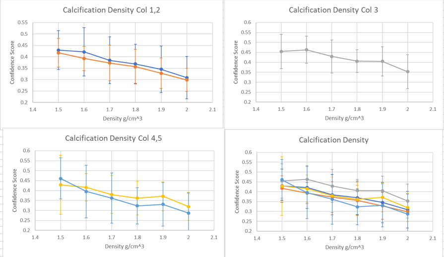

# Results of Modeling Malignant and Benign Clusters 
# Calcification Number and Cluster Size
Changing the number of calcifications, size of cluster, and size of calcifications were parameters we focused on the most. These parameters are the parameters we saw had the most consistent confidence scores and effected the confidence scores more drastically. 

## Changing Number of Calcification and Size of Cluster (Version 2) 

### Description
(slide 8 in presentation) 
Experimented with varying size of cluster for 5 mm (71 voxels), 10 mm (142 voxels), and 20 mm (285 voxels). Calcifications varied from 10 to 50 in increments of 10. For 5 and 10 mm, each phantom had 3 rows by 4 columns of clusters, and for 20 mm, each phantom had 3 rows by 3 columns. We ran this experiment twice, once with mixed sized calcs (3-9 voxels) and small sized calcs (3-5 voxels). Images are located [here](https://github.com/marianqian/cluster_generation_data/tree/master/num_calcs_size_cluster/num_calcs_size_cluster_v2).

### Specifications
1. Calc size: varied between 3-9 voxels (mixed) and 3-5 voxels (small) 
2. Density in MC-GPU simulation: 1.6
3. Preprocessing: Default values (25th to 100th percentile, masked 400,000, took values greater than 0.7) 

### Data
#### Mixed 
The image below is of an example 10 mm with 40 mixed sized calcification clusters. 

#### Small
We also ran the same exact experiment but with **small** calcifications where the calcifications ranged from 3 to 5 voxels. Here is an image of 10 mm with 40 small sized calcification clusters. 

### Results
#### Mixed

| MIXED (3-9) | 10                | 20              | 30               | 40                | 50               |
|-------------|-------------------|-----------------|------------------|-------------------|------------------|
| 5 (71 vx)   | 0.171±0.104       | 0.419±0.103     | 0.429±0.068      | 0.464±0.089       | 0.498±0.072      |
| 10 (142 vx) | 0.21±0.183        | 0.232±0.156     | 0.467±0.146      | 0.572±0.123       | 0.624±0.179      |
| 20 (285 vx) | 0.071±0.042       | 0.275±0.174     | 0.189±0.103      | 0.431±0.152       | 0.407±0.191      |

#### Small
| SMALL (3-5) | 10                | 20              | 30               | 40                | 50               |
|-------------|-------------------|-----------------|------------------|-------------------|------------------|
| 5 (71 vx)   | 0.084±0.05        | 0.117±0.051     | 0.104±0.062      | 0.122±0.053       | 0.085±0.032      |
| 10 (142 vx) | 0.184±0.125       | 0.344±0.135     | 0.402±0.122      | 0.451±0.089       | 0.516±0.096      |
| 20 (285 vx) | 0.119±0.103       | 0.14±0.117      | 0.236±0.149      | 0.143±0.082       | 0.354±0.166      |

Most averages had 12 values, but for most of the 20 mm sized clusters, the CAD algorithm didn't detect 3-5 of the clusters. The highest values were with small calcs/10 mm/50 calcs. From the graph, it looks like the 5 mm with small calcs had higher confidence scores compared to the 5 mm mixed calcs consistently as well. The lowest scores were from mixed calcs/5 mm/10 calcs and small calcs/20 mm/10 calcs (for this one the CAD algorithm had a hard time detecting the clusters as well.) 

Clusters with more calcifications had a higher malignancy confidence score where the confidence scores show an upward trend as the number of calcs increase for 5 and 10 mm sized clusters. 10 mm sized clusters also had higher scores compared to the other sizes (orange points). The clusters with smaller calcifications had a noticeable increase in malignancy scores.

## Changing Size of Calcification and Size of Cluster (Version 1) OLD
### Description
Experimented with varying size of cluster for 5 mm (71 voxels), 10 mm (142 voxels), and 20 mm (285 voxels). Calcifications varied from 10 to 50 in increments of 10. For the data points, each phantom had 5 clusters with each cluster having a different number of calcifications with the same cluster size. There were phantoms for each cluster size. Images are located [here](https://github.com/marianqian/cluster_generation_data/tree/master/num_calcs_size_cluster/num_calcs_size_cluster_v1). 

### Specifications
1. Calc size: varied between 3-9 voxels (mixed) 
2. Density in MC-GPU simulation: 1.6
3. Preprocessing: Default values (25th to 100th percentile, masked 400,000, took values greater than 0.7) 

### Data
Image of 10 mm sized cluster. 

### Results

| mm^3            |  |                   |                   |                   |                   |
|-----------------|-------------------------------|-------------------|-------------------|-------------------|-------------------|
| Size of cluster | 10                            | 20                | 30                | 40                | 50                |
| 5 (71 vx)       | 0.094±0.099-0.094             | 0.114±0.096-0.096 | 0.091±0.021-0.021 | 0.081±0.045-0.045 | 0.079±0.02-0.02   |
| 10 (142 vx)     | 0.105±0.143-0.104             | 0.247±0.202-0.202 | 0.255±0.135-0.135 | 0.331±0.133-0.133 | 0.382±0.088-0.088 |
| 20 (285 vx)     | 0.019±0.032-0.018             | 0.125±0.08-0.08   | 0.11±0.202-0.108  | 0.229±0.126-0.126 | 0.266±0.06-0.247  |

Each mean was across 5 values. The error bars were **not** standard deviation, but was the average of the maximum and minimum values. The 10 mm clusters also showed higher scores than the other sizes, and we saw a higher number of calcifications led to a higher malignancy score. 

## Modeling Non-Uniform Clusters
### Description
Because the smaller sized calcifications showed an increase in confidence scores, we tried creating nonuniform clusters where 10% of the calcifications were sized 7-9 voxels. We found the confidence scores for 5 mm and 10 mm sized clusters with 40 calcs. There was one phantom for 12 clusters of 5 mm, and another phantom for 12 clusters of 10 mm. The averages computed here are across the 12 values. Images are located [here](https://github.com/marianqian/cluster_generation_data/tree/master/nonuniform_clusters). 

### Specifications
1. Calc size: varied between 3-9 voxels (mixed) with 10% of calcifications being 7-9 voxels  
2. Density in MC-GPU simulation: 1.6
3. Preprocessing: Default values (25th to 100th percentile, masked 400,000, took values greater than 0.7) 

### Data

10 mm sized cluster with 40 calcs. 

5 mm sized cluster with 40 calcs. 

### Results

| 10 mm | col 1    | col 2       | col 3    | col 4    | 5 mm  | col 1    | col 2       | col 3    | col 4    |
|-------|----------|-------------|----------|----------|-------|----------|-------------|----------|----------|
| row 1 | 0.556733 | 0.543662    | 0.281778 | 0.653176 | row 1 | 0.101907 | 0.201929    | 0.214445 | 0.290343 |
| row 2 | 0.673025 | 0.495329    | 0.438144 | 0.595632 | row 2 | 0.217172 | 0.17257     | 0.174818 | 0.182554 |
| row 3 | 0.641574 | 0.520911    | 0.639943 | 0.548619 | row 3 | 0.181075 | 0.299382    | 0.149039 | 0.100873 |
|       | Mean     | 0.549±0.105 |          |          |       | Mean     | 0.191±0.059 |          |          |

# Experiments focusing on brightness of the calcification (location, density, calcification size)

We saw through our experiments that calcifications that were too bright would lead to a decrease in confidence scores possibly because they are too unrealistic. This was shown through changing the density settings in MC-GPU (lower densities had higher scores) and increasing the size of calcifications (smaller calc sizes had higher scores). Clusters near the chest wall also had higher scores which could be due to change in brightness (discussed more in detail below). 

## Calcification Density (version 2)
### Description
Experimented with the density setting in MC-GPU to see whether the brightness had an impact on the confidence score. The density values we tested were from 1.5 to 2.0 g/cm^3, and a lower density results in a dimmer image where the calcifications do not show up as bright. We used 10 different phantoms with 5 clusters placed in the same location (along the middle of the breast), but the individual calcification locations were different. The clusters were of 10 mm sized and 40 calcifications. The averages were based on 10 values in the same column across the 10 different breast phantoms. Images located [here](https://github.com/marianqian/cluster_generation_data/tree/master/calc_density/calc_density_v2). 

### Specifications
1. Calc size: varied between 3-9 voxels (mixed)   
2. Density in MC-GPU simulation: 1.5-2.0 (varied)
3. Preprocessing: Default values (25th to 100th percentile, masked 400,000, took values greater than 0.7) 

### Results

|     | col 1       | col 2       | col 3       | col 4       | col 5       |
|-----|-------------|-------------|-------------|-------------|-------------|
| 1.5 | 0.429±0.085 | 0.418±0.063 | 0.455±0.086 | 0.429±0.148 | 0.461±0.103 |
| 1.6 | 0.422±0.106 | 0.393±0.053 | 0.463±0.069 | 0.416±0.069 | 0.395±0.132 |
| 1.7 | 0.384±0.102 | 0.373±0.078 | 0.429±0.084 | 0.38±0.095  | 0.362±0.127 |
| 1.8 | 0.369±0.085 | 0.357±0.076 | 0.406±0.057 | 0.362±0.084 | 0.323±0.091 |
| 1.9 | 0.345±0.103 | 0.328±0.067 | 0.405±0.073 | 0.371±0.073 | 0.331±0.109 |
| 2   | 0.308±0.093 | 0.299±0.05  | 0.353±0.086 | 0.32±0.071  | 0.287±0.101 |

The graphs show a consistent trend for lower densities having higher confidence scores. The standard deviations for most of the values were around 0.1. 

## Calcification Density (version 3) tried some experiments 
### Description
We tried using another breast phantom made by Dr. Andrey Makeev of a uniform ellipsoid breast phantom with only two materials, 0 for air and 1 for adipose tissue. The phantom had 15 clusters, each 10 mm sized with 40 calcifications. Images with different density settings from 1.5 to 2.0 and the breast phantom can be found [here](https://github.com/marianqian/cluster_generation_data/tree/master/calc_density/calc_density_v3). 

### Specifications
1. Calc size: varied between 3-9 voxels (mixed)   
2. Density in MC-GPU simulation: 1.5-2.0 (varied)
3. Preprocessing: Had to manually process due to the new breast phantom 

## Data
Generated image output of 1.6 density. 15 clusters, 10 mm and 40 calcifications. 

Output of the CAD algorithm

We decided to use this approach so that the background would be uniform, and that would reduce the variability between the clusters, which would hopefully allow for less variation in the confidence scores from the CAD algorithm. However, we did not proceed with this approach because the algorithm gave a large range of values for several clusters that visually looked similar. 

## Calcification Density (version 1) OLD
### Description
An older experiment testing changing the density in MC-GPU. The density values we tested were from 1.5 to 2.0 g/cm^3, and a lower density results in a dimmer image where the calcifications do not show up as bright. The phantom contained 5 clusters along the middle of the breast, and the averages were based on those 5 values. The same phantom was used for all the different density settings. Each cluster was 10 mm with 40 calcs, and we tested this with mixed (3-9 voxel) calcs and small (3-5 voxel) calcs. Images are located [here](https://github.com/marianqian/cluster_generation_data/tree/master/calc_density/calc_density_v1). 

### Specifications
1. Calc size: varied between 3-9 voxels (mixed), 3-5 voxels (small)   
2. Density in MC-GPU simulation: 1.5-2.0 (varied)
3. Preprocessing: Default values (25th to 100th percentile, masked 400,000, took values greater than 0.7) 

### Results

Graph only shows values for the **mixed** clusters. 

|              Density   g/cm^3    |             1.5    |             1.6    |            1.7    |            1.8    |             1.9    |               2    |
|---------------------------------:|-------------------:|-------------------:|------------------:|------------------:|-------------------:|-------------------:|
|     10   mm - 40 calcs (mixed, 3-9)    |     0.498±0.056    |     0.421±0.074    |     0.397±0.09    |     0.406±0.09    |     0.365±0.067    |     0.347±0.082    |
| 10 mm - 40 calcs (small, 3-5) | 0.346±0.222 | 0.565±0.154 | 0.434±0.26 | 0.347±0.082 | 0.609±0.056 | 0.629±0.11 |

For the mixed calcs, lower density settings had higher malignancy scores. For the small clusters, they had higher scores for a higher density setting, which could possibly be because the lower settings did not allow the smaller calcs to show up bright enough. The error bars were **not** standard deviation, but was the average of the maximum and minimum values. 

Some bounding boxes had really high malignancy scores (0.8) near the chest wall, and it included several clusters as well. Might be that with a mass -> more malignant, but will have to investigate further. 

## Cluster Location
### Description
Changed the cluster location to either near the chest wall or to the nipple. Tested with 4 different configurations of cluster size and calc number: (10 mm, 50 calcs), (10 mm, 40 calcs), (10 mm, 30 calcs), (20 mm, 50 calcs). Below shows the configuration of the clusters, and the averages were across 4 values. Images located [here](https://github.com/marianqian/cluster_generation_data/tree/master/cluster_location). 
### Specifications
1. Calc size: varied between 3-9 voxels (mixed) 
2. Density in MC-GPU simulation: 1.6
3. Preprocessing: Default values (25th to 100th percentile, masked 400,000, took values greater than 0.7) 
### Data
Image from `cluster_location_v1`, contains the (20 mm, 50 calcs) large cluster and (10 mm, 50 calcs) small clusters. 

Image from `cluster_location_v2`, contains the (10 mm, 30 calcs) left cluster and (10 mm, 40 calcs) right cluster.

### Results

| mm^3 (mixed)    | mean+std    |             |                    |
|-----------------|-------------|-------------|--------------------|
| Size of cluster | chest wall  | nipple      |     Mixed (3-9)    |
| 10 mm - 40      | 0.609±0.073 | 0.359±0.14  |     0.188±0.15     |
| 10 mm - 50      | 0.454±0.088 | 0.211±0.026 |     0.374±0.087    |
| 10 mm - 30      | 0.309±0.131 | 0.174±0.048 |     0.169±0.089    |
| 20 mm - 50      | 0.442±0.18  | 0.289±0.162 |     0.191±0.191    |

Clusters closer to the chest wall had a higher malignancy scores, surprisingly. Because clusters near the chest wall are not as common as clusters near the nipple, there might be other factors that contribute to its higher score. One potential reason could be that since the breast could be thicker near the chest wall, the clusters appear dimmer, which then could lead to a higher confidence score. Still not a confirmed conclusion, but because from other experiments we saw that dimmer clusters did have higher scores, this could be a possibility.

## Calcification Size (version 1) 
### Description
Tested calcification sized of 3-9 voxels (mixed), 3-5 voxels (small), and 7-9 voxels (large) with 6 different configurations of cluster size and calc number: (5 mm, 50 calcs), (5 mm, 40 calcs), (10 mm, 50 calcs), (10 mm, 40 calcs), (20 mm, 50 calcs), (20 mm, 40 calcs). Phantoms contained only one cluster size with one row of 40 calcs and another for 50 calcs. In that row, there would be 3 clusters, one for mixed, large, and small. Below shows the configuration of the clusters, and the averages were across 5 values. Images located [here](https://github.com/marianqian/cluster_generation_data/tree/master/calc_size/calc_size_v1). The images are separated based on cluster size. 

### Specifications
1. Calc size: varied between 3-9 voxels (mixed), 3-5 voxels (small), 7-9 voxels (large)
2. Density in MC-GPU simulation: 1.6
3. Preprocessing: Default values (25th to 100th percentile, masked 400,000, took values greater than 0.7) 

### Data

Image for 10 mm cluster. Top row has 40 calcs, bottom row has 50 calcs. The order of the clusters are mixed, large, and small from left to right. 

### Results

|     mm^3               |                      |                     |                    |
|------------------------|----------------------|---------------------|--------------------|
|     Size of cluster    |     Smaller (3-5)    |     Larger (7-9)    |     Mixed (3-9)    |
|     5 mm - 40          |     0.369±0.151      |     0.078±0.019     |     0.188±0.15     |
|     10 mm - 40         |     0.669±0.052      |     0.318±0.088     |     0.374±0.087    |
|     20 mm - 40         |     0.128±0.158      |     0.144±0.028     |     0.169±0.089    |
|     5 mm - 50          |     0.323±0.159      |     0.072±0.008     |     0.191±0.191    |
|     10 mm - 50         |     0.485±0.169      |     0.354±0.097     |     0.411±0.068    |
|     20 mm - 50         |     0±0.159          |     0.27±0.082      |     0.287±0.156    |

Smaller calcifications had increased confidence scores for 5 and 10 mm sized clusters. Only scores for the 10 mm sized clusters are shown in the bar graph for clarity. The blue represents the confidence scores of the smaller calcs. One reason that could be behind why the smaller sized calcs had a higher confidence score is how bright it shows up in the simulated image. Because they are smaller, they appear dimmer, while the larger calcs show up much brighter, causing them to be unrealistic to the CAD algorithm. 

## Calcification Size (version 2) double checking 
### Description
Tested calcification sized again of 3-9 voxels (mixed), 3-5 voxels (small), and 7-9 voxels (large), this time with 2 different configurations of cluster size and calc number: (10 mm, 50 calcs), (10 mm, 40 calcs). 5 different phantoms were used, where each phantom contained only type of cluster (same calc number and calc size). Because the breast phantom changed, the background also changed. Each phantom had 15 clusters, 3 rows by 5 columns. The averages listed below are based off the 5 values in the middle row. Images located [here](https://github.com/marianqian/cluster_generation_data/tree/master/calc_size/calc_size_v2). The images are separated based on calcification size. 

### Specifications
1. Calc size: varied between 3-9 voxels (mixed), 3-5 voxels (small), 7-9 voxels (large)
2. Density in MC-GPU simulation: 1.6
3. Preprocessing: Default values (25th to 100th percentile, masked 400,000, took values greater than 0.7) 

### Data
Image of breast phantom #1 with 10 mm sized cluster of 40 **large** calcifications.

### Results
Mean and Standard Deviation. p0-p5 are for the different breast phantom for different backgrounds. 
| mm^3            |               |              |             |
|-----------------|---------------|--------------|-------------|
| Size of cluster | Smaller (3-5) | Larger (7-9) | Mixed       |
| p0              |               |              |             |
| 10 mm - 40      | 0.669±0.052   | 0.318±0.088  | 0.374±0.087 |
| 10 mm - 50      | 0.485±0.169   | 0.354±0.097  | 0.411±0.068 |
| p1              |               |              |             |
| 10 mm - 40      | 0.523±0.229   | 0.391±0.135  | 0.363±0.061 |
| 10 mm - 50      | 0.433±0.251   | 0.268±0.074  | 0.471±0.123 |
| p2              |               |              |             |
| 10 mm - 40      | 0.55±0.256    | 0.307±0.115  | 0.343±0.117 |
| 10 mm - 50      | 0.745±0.082   | 0.422±0.066  | 0.427±0.102 |
| p3              |               |              |             |
| 10 mm - 40      | 0.542±0.101   | 0.339±0.031  | 0.44±0.063  |
| 10 mm - 50      | 0.374±0.189   | 0.342±0.036  | 0.404±0.061 |
| p4              |               |              |             |
| 10 mm - 40      | 0.422±0.177   | 0.359±0.089  | 0.427±0.082 |
| 10 mm - 50      | 0.516±0.137   | 0.32±0.093   | 0.461±0.123 |

The smaller calcifications continued to show higher confidence scores. 

# Other experiments 
## Calcification Shape
### Description
Changed calcification shape to be rod-like instead of spherical. Tested with 4 configurations of cluster size and calc number: (20 mm, 50 calcs), (10 mm, 50 calcs), (10 mm, 40 calcs), (10 mm, 30 calcs). Each phantom contained three rows: 1st row for spherical, 2nd row for rod-like, and 3rd row for rod-like and spherical calcifications. The order of the clusters left to right are: (20 mm, 50 calcs), (10 mm, 50 calcs), (10 mm, 40 calcs), (10 mm, 30 calcs). The averages listed below are based off of 5 values. Images located [here](https://github.com/marianqian/cluster_generation_data/tree/master/calc_shape). 

### Specifications
1. Calc size: varied between 3-9 voxels (mixed) 
2. Density in MC-GPU simulation: 1.6
3. Preprocessing: Default values (25th to 100th percentile, masked 400,000, took values greater than 0.7) 
### Data

Image of clusters with different calcification shapes. From left to right: (20 mm, 50 calcs), (10 mm, 50 calcs), (10 mm, 40 calcs), (10 mm, 30 calcs). Rows: 1st is spherical, 2nd is rod-like, 3rd is both. 

### Results
Mean and Standard Deviation. 
| mm^3 (mixed)    | mean+std    |             |             |
|-----------------|-------------|-------------|-------------|
| Size of cluster | spherical   | rod like    | both        |
| 10 mm - 30      | 0.289±0.183 | 0.518±0.09  | 0.381±0.1   |
| 10 mm - 40      | 0.479±0.074 | 0.389±0.176 | 0.272±0.048 |
| 10 mm - 50      | 0.443±0.093 | 0.5±0.077   | 0.349±0.161 |
| 20 mm - 50      | 0.519±0.124 | 0.23±0.14   | 0.471±0.208 |

Sometimes the spherical calcs have a higher score and other times the rod-like calcifications have a higher score. No definite conclusion about whether having rod-like clusters would increase malignancy scores. 

## Linear Clusters
### Description
Tested whether changing the cluster shape into a linear pattern would influence malignancy scores. Tried several different configurations listed below:  

* **(3-7_linear_15-30)** Linear cluster, 3-7 voxel sized calcs, calcs had to be min 15 and max 30 pixels away from the center line. 
* **(3-7_linear_15-30_same_cluster)** Linear cluster, 3-7 voxel sized calcs, calcs had to be min 15 and max 30 pixels away from the center line. **the same cluster with same calc locations was placed throughout the phantom**
* **(3-9_linear_0-15)** Linear cluster, 3-9 voxel sized calcs, calcs had to be min 0 and max 15 pixels away from the center line.
* **(3-9_linear_5-20)** Linear cluster, 3-9 voxel sized calcs, calcs had to be min 5 and max 20 pixels away from the center line. 
* **(3-9_linear_15-30)** Linear cluster, 3-9 voxel sized calcs, calcs had to be min 15 and max 30 pixels away from the center line. 
* **(3-7_random)** Random cluster, 3-7 voxel sized calcs
* **(3-9_random)** Random cluster, 3-9 voxel sized calcs

In each of these configurations, there were phantoms for the following: (10 mm, 20 calcs), (10 mm, 30 calcs), (10 mm, 40 calcs), (10 mm, 50 calcs), (20 mm, 50 calcs). Each phantom one configuration of 3 rows by 4 columns of clusters. The averages of each configuration was based on the 4 clusters in the middle row. Images located [here](https://github.com/marianqian/cluster_generation_data/tree/master/linear_cluster). 

### Specifications
1. Calc size: varied between 3-9 voxels (mixed) and 3-7 voxels 
2. Density in MC-GPU simulation: 1.6
3. Preprocessing: Default values (25th to 100th percentile, masked 400,000, took values greater than 0.7) 

### Data
Image of linear cluster of 10 mm and 20 calcs. The calcs were 3-7 voxel sized and had to be min 15 pixels and max 30 pixels away from the center line. 

### Results

| mm^3            | mean+std         |                               |                 |                 |                  |              |              |
|-----------------|------------------|-------------------------------|-----------------|-----------------|------------------|--------------|--------------|
| Size of cluster | 3-7_linear_15-30 | 3-7_linear_15-30_same_cluster | 3-9_linear_0-15 | 3-9_linear_5-20 | 3-9_linear_15-30 | 3-7_random   | 3-9_random   |
| 10 mm - 20      | 0.367±0.065      | 0.391±0.065                   | 0.145±0.029     | 0.166±0.027     | 0.212±0.076      | 0.447±0.078  | 0.405±0.077  |
| 10 mm - 30      | 0.501±0.032      | 0.393±0.072                   | 0.124±0.045     | 0.188±0.038     | 0.253±0.057      | 0.509±0.068  | 0.374±0.058  |
| 10 mm - 40      | 0.518±0.082      | 0.455±0.054                   | 0.115±0.014     | 0.171±0.046     | 0.264±0.055      | 0.599±0.056  | 0.469±0.032  |
| 10 mm - 50      | 0.525±0.046      | 0.51±0.033                    | 0.059±0.019     | 0.18±0.055      | 0.371±0.06       | 0.734±0.023  | 0.545±0.036  |
| 20 mm - 50      | 0.499±0.127      | 0.481±0.125                   | 0.118±0.038     | 0.196±0.058     | 0.215±0.059      | Not enough data | Not enough data |

### Future Steps 
The linear clusters didn't have as high malignancy scores compared to the random clusters, but there was also variability in this experiment. Some future steps: 
1. Location of the linear cluster might impact the score
2. Make the linear clusters that are tightly clustered together and have more calcifications to be less bright. 
3. Make linear clusters longer and more sparsely distributed. 
4. Vary the length, number of calcifications, and how dense the linear cluster is to see how well the CAD algorithm performs. 
5. Preprocessing might make a difference (the ones for this experiment was with the default values). 

## Mass
### Description
For CAD algorithm, tested simulated spiculated masses created by Nick Neirotti. Simulated using fredenberg mass material file. Images located [here](https://github.com/marianqian/cluster_generation_data/tree/master/mass). 
### Specifications
1. Density in MC-GPU simulation: 1.06
2. Preprocessing: Default values (25th to 100th percentile, masked 400,000, took values greater than 0.7) 

### Data
Simulated processed image.
 

CAD output 
 

The highest two lesions had very noticable spiculations. and the highest scoring mass was slightly deformed/irregularly shaped. This could lead to how having lesions that are not perfectly spheres could possibly increase the malignancy confidence score. 

# Future Steps
Other factors that could influence malignancy confidence score:
* Using scatter vs. non-scatter image. 
* Changing the pixel size on the detector. (If pixel size was larger, would that increase malignancy score?)
* Changing preprocess values for the MC-GPU output images. (For these experiments, only used default (25th to 100th percentile, masked 400,000, took values greater than 0.7).

For masses to see influence on confidence score:
* Place masses in same location but in different phantoms.
* Place masses in uniform phantom.
* Populate phantom with perfect sphere masses.
* Take masses and replicate them across a phantom so the only difference is the location. 

# Other CAD outputs 
ROI 
the other zahara images

