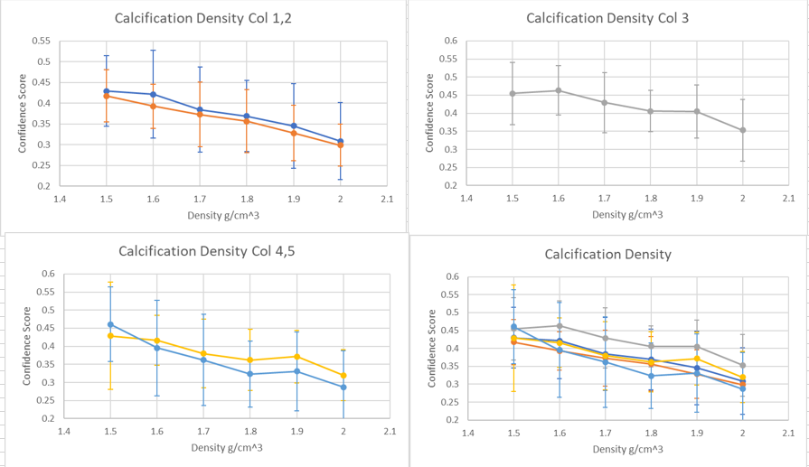
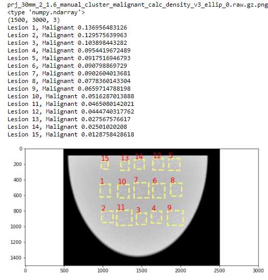
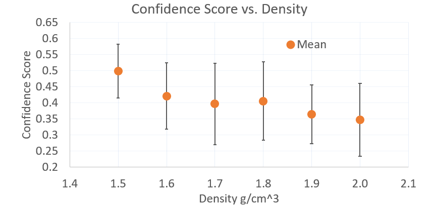

Each output image has .RAW and .PNG file. 

`calc_density_v2`: Separated into folders with the density setting. In each folder, there are 10 different images labelled with number 0 to 9, indicating the 10 different breast phantoms. The clusters were placed in the same location of 3 rows by 5 columns, and the averages were only based on the clusters in the middle row. The difference between the phantoms is that the individual calc positions within each cluster is different. Each cluster is of 10 mm and 40 mixed calcs. 

`calc_density_v3` **uniform phantom**: Contains one uniform phantom with clusters of 10 mm and 40 calcs placed in 3 rows by 5 columns. Filenames have density setting it was ran at 1.5 to 2.0. This folder also contains the zipped uniform phantom file. The `images/` folder has the CAD output for 1.2, 1.3 and 1.6 density settings of this uniform phantom. 

`calc_density_v1` **old experiment**: Separated into `mixed/` and `small/` folders. One phantom with clusters with 10 mm and 40 calcs placed in 3 rows by 5 columns. The filenames have the density setting it has ran at 1.5 to 2.0. 

From the README.md

# [Experiments focusing on brightness of the calcification (location, density, calcification size)](https://github.com/marianqian/cluster_generation_data#experiments-focusing-on-brightness-of-the-calcification-location-density-calcification-size)

We saw through our experiments that calcifications that were too bright would lead to a decrease in confidence scores possibly because they are too unrealistic. This was shown through changing the density settings in MC-GPU (lower densities had higher scores) and increasing the size of calcifications (smaller calc sizes had higher scores). Clusters near the chest wall also had higher scores which could be due to change in brightness (discussed more in detail below). 

## Calcification Density (version 2)
### Description
Experimented with the density setting in MC-GPU to see whether the brightness had an impact on the confidence score. The density values we tested were from 1.5 to 2.0 g/cm^3, and a lower density results in a dimmer image where the calcifications do not show up as bright. We used 10 different phantoms with 5 clusters placed in the same location (along the middle of the breast), but the individual calcification locations were different. The clusters were of 10 mm sized and 40 calcifications. The averages were based on 10 values in the same column across the 10 different breast phantoms. Images located [here](https://github.com/marianqian/cluster_generation_data/tree/master/calc_density/calc_density_v2). 

### Specifications
1. Calc size: varied between 3-9 voxels (mixed)   
2. Density in MC-GPU simulation: 1.5-2.0 (varied)
3. Preprocessing: Default values (25th to 100th percentile, masked 400,000, took values greater than 0.7) 

### Results

|     | col 1       | col 2       | col 3       | col 4       | col 5       |
|-----|-------------|-------------|-------------|-------------|-------------|
| 1.5 | 0.429±0.085 | 0.418±0.063 | 0.455±0.086 | 0.429±0.148 | 0.461±0.103 |
| 1.6 | 0.422±0.106 | 0.393±0.053 | 0.463±0.069 | 0.416±0.069 | 0.395±0.132 |
| 1.7 | 0.384±0.102 | 0.373±0.078 | 0.429±0.084 | 0.38±0.095  | 0.362±0.127 |
| 1.8 | 0.369±0.085 | 0.357±0.076 | 0.406±0.057 | 0.362±0.084 | 0.323±0.091 |
| 1.9 | 0.345±0.103 | 0.328±0.067 | 0.405±0.073 | 0.371±0.073 | 0.331±0.109 |
| 2   | 0.308±0.093 | 0.299±0.05  | 0.353±0.086 | 0.32±0.071  | 0.287±0.101 |

The graphs show a consistent trend for lower densities having higher confidence scores. The standard deviations for most of the values were around 0.1. 

## Calcification Density (version 3) tried some experiments 
### Description
We tried using another breast phantom made by Dr. Andrey Makeev of a uniform ellipsoid breast phantom with only two materials, 0 for air and 1 for adipose tissue. The phantom had 15 clusters, each 10 mm sized with 40 calcifications. Images with different density settings from 1.5 to 2.0 and the breast phantom can be found [here](https://github.com/marianqian/cluster_generation_data/tree/master/calc_density/calc_density_v3). 

### Specifications
1. Calc size: varied between 3-9 voxels (mixed)   
2. Density in MC-GPU simulation: 1.5-2.0 (varied)
3. Preprocessing: Had to manually process due to the new breast phantom 

## Data
Generated image output of 1.6 density. 15 clusters, 10 mm and 40 calcifications. 

Output of the CAD algorithm

We decided to use this approach so that the background would be uniform, and that would reduce the variability between the clusters, which would hopefully allow for less variation in the confidence scores from the CAD algorithm. However, we did not proceed with this approach because the algorithm gave a large range of values for several clusters that visually looked similar. 

## Calcification Density (version 1) OLD
### Description
An older experiment testing changing the density in MC-GPU. The density values we tested were from 1.5 to 2.0 g/cm^3, and a lower density results in a dimmer image where the calcifications do not show up as bright. The phantom contained 5 clusters along the middle of the breast, and the averages were based on those 5 values. The same phantom was used for all the different density settings. Each cluster was 10 mm with 40 calcs, and we tested this with mixed (3-9 voxel) calcs and small (3-5 voxel) calcs. Images are located [here](https://github.com/marianqian/cluster_generation_data/tree/master/calc_density/calc_density_v1). 

### Specifications
1. Calc size: varied between 3-9 voxels (mixed), 3-5 voxels (small)   
2. Density in MC-GPU simulation: 1.5-2.0 (varied)
3. Preprocessing: Default values (25th to 100th percentile, masked 400,000, took values greater than 0.7) 

### Results

Graph only shows values for the **mixed** clusters. 

|              Density   g/cm^3    |             1.5    |             1.6    |            1.7    |            1.8    |             1.9    |               2    |
|---------------------------------:|-------------------:|-------------------:|------------------:|------------------:|-------------------:|-------------------:|
|     10   mm - 40 calcs (mixed, 3-9)    |     0.498±0.056    |     0.421±0.074    |     0.397±0.09    |     0.406±0.09    |     0.365±0.067    |     0.347±0.082    |
| 10 mm - 40 calcs (small, 3-5) | 0.346±0.222 | 0.565±0.154 | 0.434±0.26 | 0.347±0.082 | 0.609±0.056 | 0.629±0.11 |

For the mixed calcs, lower density settings had higher malignancy scores. For the small clusters, they had higher scores for a higher density setting, which could possibly be because the lower settings did not allow the smaller calcs to show up bright enough. The error bars were **not** standard deviation, but was the average of the maximum and minimum values. 

Some bounding boxes had really high malignancy scores (0.8) near the chest wall, and it included several clusters as well. Might be that with a mass -> more malignant, but will have to investigate further. 
