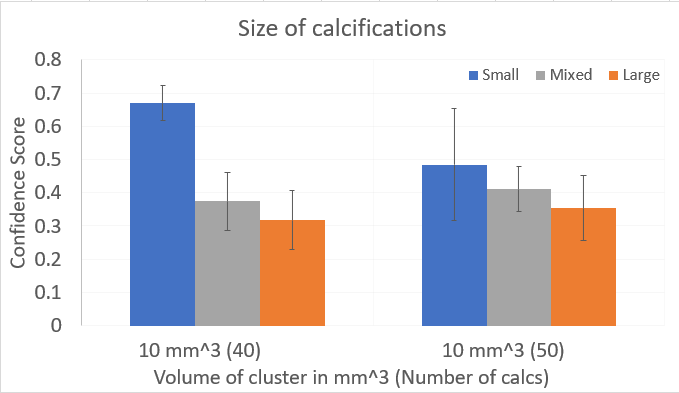

Each output image has a .RAW and .PNG file. 

`calc_size_v1`: Separated into folders based on cluster size. Each phantom contained 6 different configurations: (5 mm, 50 calcs), (5 mm, 40 calcs), (10 mm, 50 calcs), (10 mm, 40 calcs), (20 mm, 50 calcs), (20 mm, 40 calcs). The top row was for clusters with 40 calcs and the bottom row for clusters of 50 calcs. There are 5 phantoms where the individual calcification location is different, and the images are labelled with 0, 1, 2, 3, or 5.

`calc_size_v2` **double checking findings from version 1** : Separated into folders based on large, mixed or small calcifications. The file name for each image contains which phantom (p0, p1, p2, p3, or p4) was used, how many calcs (40 or 50), and the size of the calcs (l for large, m for mixed, or s for small). Each phantom contains only one type of cluster (same calc number and calc size).

## [Calcification Size (version 1)](https://github.com/marianqian/cluster_generation_data#calcification-size-version-1)
### Description
Tested calcification sized of 3-9 voxels (mixed), 3-5 voxels (small), and 7-9 voxels (large) with 6 different configurations of cluster size and calc number: (5 mm, 50 calcs), (5 mm, 40 calcs), (10 mm, 50 calcs), (10 mm, 40 calcs), (20 mm, 50 calcs), (20 mm, 40 calcs). Phantoms contained only one cluster size with one row of 40 calcs and another for 50 calcs. In that row, there would be 3 clusters, one for mixed, large, and small. Below shows the configuration of the clusters, and the averages were across 5 values. Images located [here](https://github.com/marianqian/cluster_generation_data/tree/master/calc_size/calc_size_v1). The images are separated based on cluster size. 

### Specifications
1. Calc size: varied between 3-9 voxels (mixed), 3-5 voxels (small), 7-9 voxels (large)
2. Density in MC-GPU simulation: 1.6
3. Preprocessing: Default values (25th to 100th percentile, masked 400,000, took values greater than 0.7) 

### Data

Image for 10 mm cluster. Top row has 40 calcs, bottom row has 50 calcs. The order of the clusters are mixed, large, and small from left to right. 

### Results

|     mm^3               |                      |                     |                    |
|------------------------|----------------------|---------------------|--------------------|
|     Size of cluster    |     Smaller (3-5)    |     Larger (7-9)    |     Mixed (3-9)    |
|     5 mm - 40          |     0.369±0.151      |     0.078±0.019     |     0.188±0.15     |
|     10 mm - 40         |     0.669±0.052      |     0.318±0.088     |     0.374±0.087    |
|     20 mm - 40         |     0.128±0.158      |     0.144±0.028     |     0.169±0.089    |
|     5 mm - 50          |     0.323±0.159      |     0.072±0.008     |     0.191±0.191    |
|     10 mm - 50         |     0.485±0.169      |     0.354±0.097     |     0.411±0.068    |
|     20 mm - 50         |     0±0.159          |     0.27±0.082      |     0.287±0.156    |

Smaller calcifications had increased confidence scores for 5 and 10 mm sized clusters. Only scores for the 10 mm sized clusters are shown in the bar graph for clarity. The blue represents the confidence scores of the smaller calcs. One reason that could be behind why the smaller sized calcs had a higher confidence score is how bright it shows up in the simulated image. Because they are smaller, they appear dimmer, while the larger calcs show up much brighter, causing them to be unrealistic to the CAD algorithm. 

## Calcification Size (version 2) double checking 
### Description
Tested calcification sized again of 3-9 voxels (mixed), 3-5 voxels (small), and 7-9 voxels (large), this time with 2 different configurations of cluster size and calc number: (10 mm, 50 calcs), (10 mm, 40 calcs). 5 different phantoms were used, where each phantom contained only type of cluster (same calc number and calc size). Because the breast phantom changed, the background also changed. Each phantom had 15 clusters, 3 rows by 5 columns. The averages listed below are based off the 5 values in the middle row. Images located [here](https://github.com/marianqian/cluster_generation_data/tree/master/calc_size/calc_size_v2). The images are separated based on calcification size. 

### Specifications
1. Calc size: varied between 3-9 voxels (mixed), 3-5 voxels (small), 7-9 voxels (large)
2. Density in MC-GPU simulation: 1.6
3. Preprocessing: Default values (25th to 100th percentile, masked 400,000, took values greater than 0.7) 

### Data
Image of breast phantom #1 with 10 mm sized cluster of 40 **large** calcifications.

### Results
Mean and Standard Deviation. p0-p5 are for the different breast phantom for different backgrounds. 
| mm^3            |               |              |             |
|-----------------|---------------|--------------|-------------|
| Size of cluster | Smaller (3-5) | Larger (7-9) | Mixed       |
| p0              |               |              |             |
| 10 mm - 40      | 0.669±0.052   | 0.318±0.088  | 0.374±0.087 |
| 10 mm - 50      | 0.485±0.169   | 0.354±0.097  | 0.411±0.068 |
| p1              |               |              |             |
| 10 mm - 40      | 0.523±0.229   | 0.391±0.135  | 0.363±0.061 |
| 10 mm - 50      | 0.433±0.251   | 0.268±0.074  | 0.471±0.123 |
| p2              |               |              |             |
| 10 mm - 40      | 0.55±0.256    | 0.307±0.115  | 0.343±0.117 |
| 10 mm - 50      | 0.745±0.082   | 0.422±0.066  | 0.427±0.102 |
| p3              |               |              |             |
| 10 mm - 40      | 0.542±0.101   | 0.339±0.031  | 0.44±0.063  |
| 10 mm - 50      | 0.374±0.189   | 0.342±0.036  | 0.404±0.061 |
| p4              |               |              |             |
| 10 mm - 40      | 0.422±0.177   | 0.359±0.089  | 0.427±0.082 |
| 10 mm - 50      | 0.516±0.137   | 0.32±0.093   | 0.461±0.123 |

The smaller calcifications continued to show higher confidence scores. 
