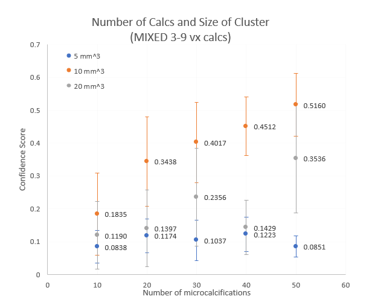
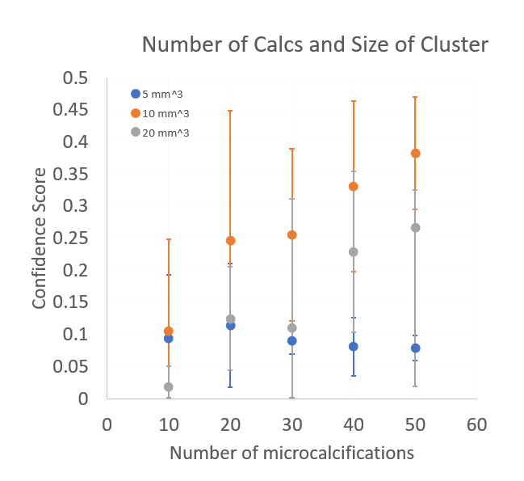

Each output image has a .RAW file and .PNG file.

`num_calcs_size_cluster_v2`: Separated into `mixed/` and `small/` folders. Each image is labelled with the cluster size in voxels (5 mm = 71 vx, 10 mm = 142 vx, 20 mm = 285 vx) and the number of calcifications from 10, 20, 30, 40, and 50. 

Ex. `prj_30mm_2_cluster_malignant_only_142_10nm_m_full_0.7_25.raw.gz.raw.png` is image for 10 mm sized cluster with 10 MIXED calcifications (`m` for mixed or `s` for small right after the number of calcifications in the image name). 

`num_calcs_size_cluster_v1` **old experiment**: There are 5 image for each size (5, 10 and 20 mm), labelled with the cluster size and 1, 2, 3, 4, or no number in the filename. In each image, there are 5 clusters with each cluster having different number of calcifications with the same cluster size.  

From the README.md

# [Calcification Number and Cluster Size](https://github.com/marianqian/cluster_generation_data#calcification-number-and-cluster-size)
Changing the number of calcifications, size of cluster, and size of calcifications were parameters we focused on the most. These parameters are the parameters we saw had the most consistent confidence scores and effected the confidence scores more drastically. 

## Changing Number of Calcification and Size of Cluster (Version 2) 

### Description
(slide 8 in presentation) 
Experimented with varying size of cluster for 5 mm (71 voxels), 10 mm (142 voxels), and 20 mm (285 voxels). Calcifications varied from 10 to 50 in increments of 10. For 5 and 10 mm, each phantom had 3 rows by 4 columns of clusters, and for 20 mm, each phantom had 3 rows by 3 columns. We ran this experiment twice, once with mixed sized calcs (3-9 voxels) and small sized calcs (3-5 voxels). Images are located [here](https://github.com/marianqian/cluster_generation_data/tree/master/num_calcs_size_cluster/num_calcs_size_cluster_v2).

### Specifications
1. Calc size: varied between 3-9 voxels (mixed) and 3-5 voxels (small) 
2. Density in MC-GPU simulation: 1.6
3. Preprocessing: Default values (25th to 100th percentile, masked 400,000, took values greater than 0.7) 

### Data
#### Mixed 
The image below is of an example 10 mm with 40 mixed sized calcification clusters. 

#### Small
We also ran the same exact experiment but with **small** calcifications where the calcifications ranged from 3 to 5 voxels. Here is an image of 10 mm with 40 small sized calcification clusters. 

### Results
#### Mixed

| MIXED (3-9) | 10                | 20              | 30               | 40                | 50               |
|-------------|-------------------|-----------------|------------------|-------------------|------------------|
| 5 (71 vx)   | 0.171±0.104       | 0.419±0.103     | 0.429±0.068      | 0.464±0.089       | 0.498±0.072      |
| 10 (142 vx) | 0.21±0.183        | 0.232±0.156     | 0.467±0.146      | 0.572±0.123       | 0.624±0.179      |
| 20 (285 vx) | 0.071±0.042       | 0.275±0.174     | 0.189±0.103      | 0.431±0.152       | 0.407±0.191      |

#### Small
| SMALL (3-5) | 10                | 20              | 30               | 40                | 50               |
|-------------|-------------------|-----------------|------------------|-------------------|------------------|
| 5 (71 vx)   | 0.084±0.05        | 0.117±0.051     | 0.104±0.062      | 0.122±0.053       | 0.085±0.032      |
| 10 (142 vx) | 0.184±0.125       | 0.344±0.135     | 0.402±0.122      | 0.451±0.089       | 0.516±0.096      |
| 20 (285 vx) | 0.119±0.103       | 0.14±0.117      | 0.236±0.149      | 0.143±0.082       | 0.354±0.166      |

Most averages had 12 values, but for most of the 20 mm sized clusters, the CAD algorithm didn't detect 3-5 of the clusters. The highest values were with small calcs/10 mm/50 calcs. From the graph, it looks like the 5 mm with small calcs had higher confidence scores compared to the 5 mm mixed calcs consistently as well. The lowest scores were from mixed calcs/5 mm/10 calcs and small calcs/20 mm/10 calcs (for this one the CAD algorithm had a hard time detecting the clusters as well.) 

Clusters with more calcifications had a higher malignancy confidence score where the confidence scores show an upward trend as the number of calcs increase for 5 and 10 mm sized clusters. 10 mm sized clusters also had higher scores compared to the other sizes (orange points). The clusters with smaller calcifications had a noticeable increase in malignancy scores.

## Changing Size of Calcification and Size of Cluster (Version 1) OLD
### Description
Experimented with varying size of cluster for 5 mm (71 voxels), 10 mm (142 voxels), and 20 mm (285 voxels). Calcifications varied from 10 to 50 in increments of 10. For the data points, each phantom had 5 clusters with each cluster having a different number of calcifications with the same cluster size. There were phantoms for each cluster size. Images are located [here](https://github.com/marianqian/cluster_generation_data/tree/master/num_calcs_size_cluster/num_calcs_size_cluster_v1). 

### Specifications
1. Calc size: varied between 3-9 voxels (mixed) 
2. Density in MC-GPU simulation: 1.6
3. Preprocessing: Default values (25th to 100th percentile, masked 400,000, took values greater than 0.7) 

### Data
Image of 10 mm sized cluster. 

### Results

| mm^3            |  |                   |                   |                   |                   |
|-----------------|-------------------------------|-------------------|-------------------|-------------------|-------------------|
| Size of cluster | 10                            | 20                | 30                | 40                | 50                |
| 5 (71 vx)       | 0.094±0.099-0.094             | 0.114±0.096-0.096 | 0.091±0.021-0.021 | 0.081±0.045-0.045 | 0.079±0.02-0.02   |
| 10 (142 vx)     | 0.105±0.143-0.104             | 0.247±0.202-0.202 | 0.255±0.135-0.135 | 0.331±0.133-0.133 | 0.382±0.088-0.088 |
| 20 (285 vx)     | 0.019±0.032-0.018             | 0.125±0.08-0.08   | 0.11±0.202-0.108  | 0.229±0.126-0.126 | 0.266±0.06-0.247  |

Each mean was across 5 values. The error bars were **not** standard deviation, but was the average of the maximum and minimum values. The 10 mm clusters also showed higher scores than the other sizes, and we saw a higher number of calcifications led to a higher malignancy score. 
